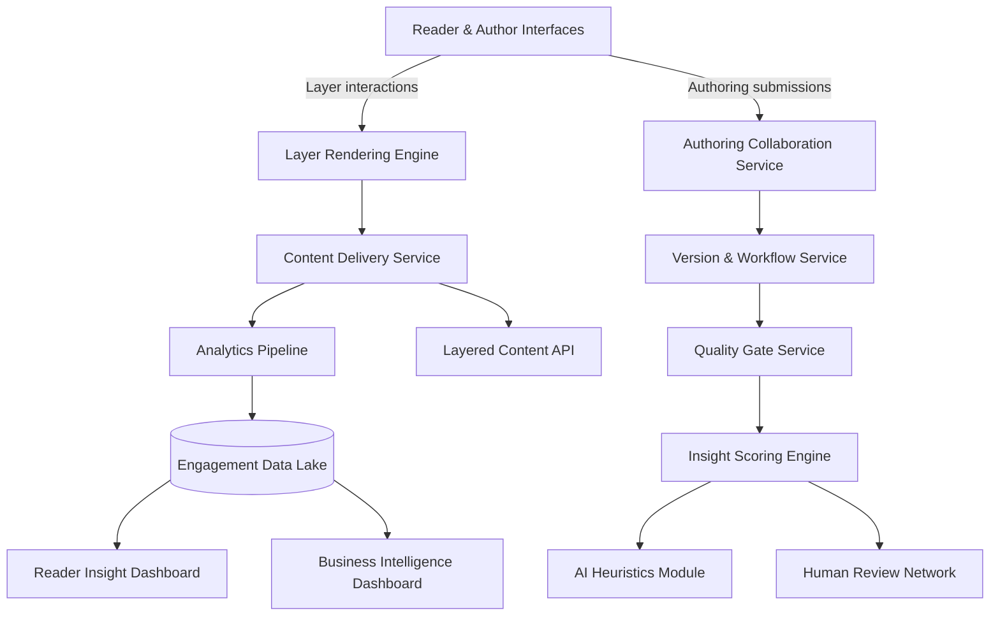

# Product & Technical Blueprint

## System Overview

### Core Services
- **Layer Rendering Engine (LRE)**: Delivers progressive disclosure UI components, animation states, and layer-specific metadata.
- **Authoring Collaboration Service (ACS)**: Provides drafting, commenting, and role-based permissions for contributors.
- **Version & Workflow Service (CVS)**: Maintains historical versions, manages approval queues, and automates escalation triggers.
- **Quality Gate Service (QGS)**: Enforces scoring thresholds, reviewer assignments, and publishes audit logs for transparency.
- **Insight Scoring Engine (ISE)**: Combines AI heuristics with human validation to grade novelty, actionability, evidence, and engagement.
- **Analytics Pipeline (ANA)**: Streams event data to warehousing layer for real-time dashboards and retention modeling.
- **Layered Content API**: Enables embedding of layered documents into partner sites and third-party applications.

## Data Flows
1. **Author Submission** → Draft stored in ACS → Workflow triggers in CVS → ISE generates preliminary score.
2. **Reviewer Actions** → QGS records verdicts → If thresholds met, CVS promotes to publish-ready state → LRE updates layer availability.
3. **Reader Engagement** → LRE emits interaction events → ANA aggregates → Dashboards refresh with layer-depth analytics.
4. **External Integrations** → API serves requested layers based on access tokens → Usage tracked for billing and monitoring.

## User Roles & Permissions
| Role | Capabilities | Checks |
|------|--------------|--------|
| Reader | Browse unlocked layers, request deeper access, submit feedback | Must accept data usage policy |
| Subscriber | Access premium layers, bookmark progress, request notifications | Billing status verified |
| Author | Draft layers up to 3, respond to reviewer feedback, view analytics | Reputation score ≥ baseline |
| Senior Author | Publish layers 1–4, mentor contributors, initiate experiments | Completion of governance training |
| Reviewer | Score insight submissions, enforce quality gates, flag disputes | Rotational assignment to avoid bias |
| Curator | Manage taxonomy, approve cross-layer links, run retrospectives | Reports to governance council |
| Admin | Configure services, manage partnerships, oversee compliance | Audit logging required |

## Workflow States
1. **Ideation** → backlog of proposed layers with metadata and expected insight delta.
2. **Drafting** → active authoring with automated linting for structure and evidence.
3. **Review** → reviewers assigned, AI heuristics produce recommendations, disputes logged.
4. **Gate Decision** → pass, revise, or reject with structured feedback.
5. **Publication** → layer made available with version tags and expiry date if applicable.
6. **Evolution** → triggers for updates based on analytics thresholds or external data feeds.

## Insight Scoring Engine Design
- **Inputs**: Author-provided thesis, supporting artifacts, reference links, preliminary metrics.
- **AI Heuristics**: Embedding-based novelty detection, factual consistency checks, sentiment analysis for engagement tone.
- **Human Review**: Weighted scoring matrix; reviewers add qualitative notes mapped to rubric categories.
- **Composite Score**: `0.6 * HumanAverage + 0.3 * AIConfidence + 0.1 * ReaderSignals`.
- **Feedback Loop**: Low-performing layers generate remediation tasks; top-performing layers highlighted for learning center.

## Analytics Dashboard Requirements
### Reader Insight Dashboard (RID)
- Layer depth funnel (L1 → L2 → L3 conversions).
- Time-on-layer heatmaps segmented by persona.
- Quality perception ratings collected post-layer.
- Exploration paths visualization (graph of traversal sequences).

### Business Intelligence Dashboard (BID)
- Subscription conversion rates by content vertical.
- Revenue attribution per layer bundle or enterprise license.
- Reviewer throughput and SLA compliance.
- Forecasting module projecting engagement based on planned content drops.

## API Surface
- `GET /documents/{id}` → returns metadata with available layer indexes.
- `GET /documents/{id}/layers/{n}` → serves content payload with gating requirements.
- `POST /layers/{id}/feedback` → captures reader insights and candidate contributions.
- `POST /layers` → author submission endpoint with schema validation.
- `GET /analytics/layer-depth` → aggregated stats for partner dashboards.

All endpoints require OAuth 2.0 with scopes reflecting role-based access.

## Security & Compliance
- Encrypt data at rest using KMS-managed keys; enforce TLS 1.3 in transit.
- Implement audit logging for every gate decision and layer publish event.
- Comply with GDPR/CCPA via granular consent tracking and data portability exports.
- Run quarterly penetration tests; integrate security checks into CI pipeline.

## Scalability Considerations
- Microservice deployment on Kubernetes with autoscaling based on queue depth.
- Edge caching of Layer 1 content via CDN; conditional caching for deeper layers.
- Event-driven architecture (Kafka) to decouple analytics pipeline from user interactions.
- Feature flag system to roll out new interaction mechanics incrementally.

## Technical Roadmap Highlights
- **MVP**: Build core services (LRE, ACS, CVS, QGS) with manual reviewer assignments and limited analytics.
- **Phase 2**: Introduce AI heuristics, role-based dashboards, and API alpha for partners.
- **Phase 3**: Full automation for reviewer routing, dynamic pricing integration, and marketplace support.
